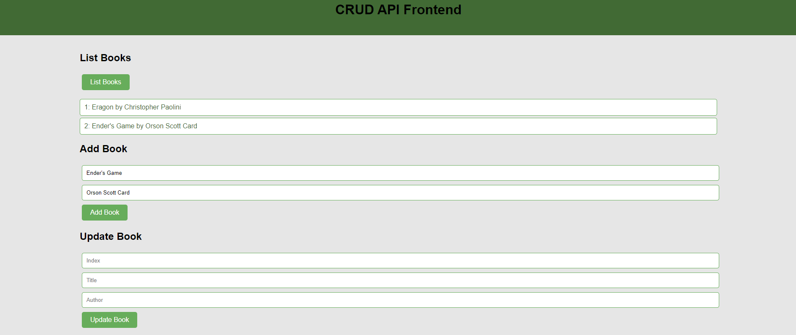

# Skylab Go Chameleon

[](https://github.com/SkylarHoughtonGithub/go-chameleon/actions/workflows/unit_test.yml)

[](https://github.com/SkylarHoughtonGithub/go-chameleon/actions/workflows/build_exe.yml)

[](https://github.com/SkylarHoughtonGithub/go-book-chameleon/actions/workflows/build_container.yml)
.
## Table of Contents
1. [Overview](#overview)
2. [Container Build](#container-build)
   - [Step 1: Go to Package page](#step-1-package-page)
   - [Step 2: Download from ghcr](#step-2-download-from-ghcr)
3. [Downloading the Artifact](#downloading-the-artifact)
   - [Step 1: Go to the Actions Tab](#step-1-go-to-the-actions-tab)
   - [Step 2: Select the Latest Workflow Run](#step-2-select-the-latest-workflow-run)
   - [Step 3: Find the Artifacts Section](#step-3-find-the-artifacts-section)
   - [Step 4: Download the Artifact](#step-4-download-the-artifact)
4. [Executing the Binary on Linux](#executing-the-binary-on-linux)
   - [Step 1: Extract the Artifact](#step-1-extract-the-artifact)
   - [Step 2: Make the Binary Executable](#step-2-make-the-binary-executable)
   - [Step 3: Run the Binary](#step-3-run-the-binary)
5. [Example Usage](#example-usage)


## Overview

This project provides a web app that performs CRUD API operations with the gin web framework and stores results in a postgres database. 
 
You can download the compiled binary as an artifact from the GitHub Actions CI/CD workflow and execute it on your Linux machine.

## Container Build
A container form to implement this application is available.

1. **Go to the Package Tab**:
Go to the [package tab](https://github.com/SkylarHoughtonGithub/go-book-chameleon/pkgs/container/go-book-chameleon)

2. **Download from ghcr**:
Make sure to use version from the package tab, but an example download would be 

```
docker pull ghcr.io/skylarhoughtongithub/go-book-chameleon:sha256-a9257b5693babf355f6f931a4af4b11b1943c8b3fedd8868895c963b920cd8d3
```
And then run in the desired container engine of your choice.

## Downloading the Artifact

To download the latest artifact from the GitHub Actions workflow, follow these steps:

1. **Go to the Actions Tab**:
   - Navigate to the [Actions](https://github.com/SkylarHoughtonGithub/go-chameleon/actions) tab in this repository.

2. **Select the Latest Workflow Run**:
   - Click on the most recent workflow run. You’ll see a list of jobs that were executed.

3. **Find the Artifacts Section**:
   - Scroll down to the "Artifacts" section at the bottom of the job details.

4. **Download the Artifact**:
   - Click on the artifact name (e.g., `skylab-book-chaemeleon.zip`) to download it to your machine.

## Executing the Binary on Linux

Once you have downloaded the artifact, follow these steps to execute the binary:

1. **Extract the Artifact**:
   - Navigate to the directory where you downloaded the artifact and extract it. If it's a ZIP file, you can use the following command:
     ```bash
     unzip skylab-book-chameleon.zip
     ```

2. **Make the Binary Executable**:
   - Change to the directory containing the binary and make it executable:
     ```bash
     chmod +x skylab-book-chameleon
     ```

## Example Usage

To start the web app, run:
```bash
./skylab-book-chameleon
```

With no postgres connection established, you should get an error: 
```bash
Failed to connect to database: dial tcp [::1]:5432: connect: connection refused
```

Make sure `./configs/config.yml` has the proper database connection and authentication details configured.

When it connects correctly, it should tell you the tables were present or created and the server has started on the requested port: 
```bash
Table created or already exists.
Starting server on :8080
```


At this point you can start submitting requests!

```bash
[GIN] 2024/09/22 - 20:55:06 | 200 |    100.5774ms |             ::1 | GET      "/static/"
[GIN] 2024/09/22 - 20:55:06 | 304 |     11.7073ms |             ::1 | GET      "/static/styles.css"
[GIN] 2024/09/22 - 20:55:06 | 304 |     35.0204ms |             ::1 | GET      "/static/books.js"
[GIN] 2024/09/22 - 20:55:06 | 200 |     23.6815ms |             ::1 | GET      "/api/books"
[GIN] 2024/09/22 - 20:55:07 | 404 |            0s |             ::1 | GET      "/favicon.ico"
[GIN] 2024/09/22 - 20:55:14 | 304 |       505.6µs |             ::1 | GET      "/static/"
[GIN] 2024/09/22 - 20:55:14 | 200 |     13.4633ms |             ::1 | GET      "/api/books"
[GIN] 2024/09/22 - 20:56:26 | 201 |     16.8652ms |             ::1 | POST     "/api/books"
[GIN] 2024/09/22 - 20:56:26 | 200 |      3.6384ms |             ::1 | GET      "/api/books"
```